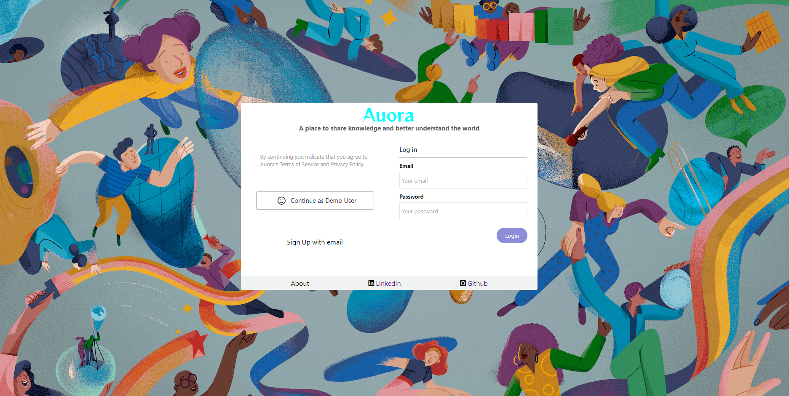
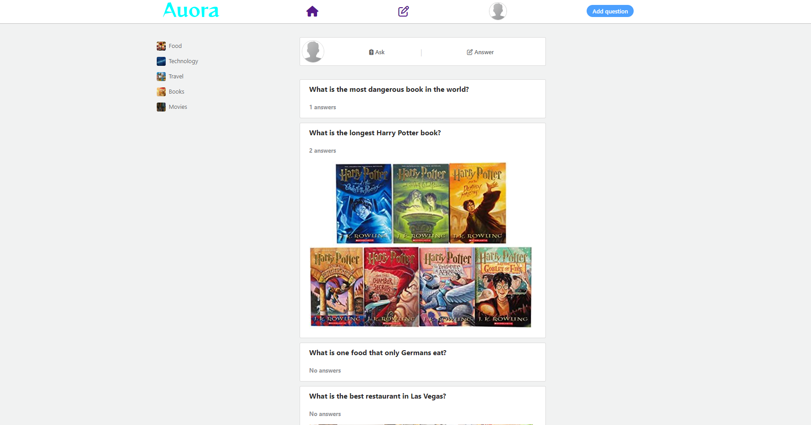

# Auora

Auora is a web-application clone inspired by [Quora](https://www.quora.com/), that allows users to ask and answer questions through the platform. It is also a place to social with the people with same interests.

* [Auora](https://auora.herokuapp.com/)

### Please see below links to Project Wiki:

##### [MVP Feature List](https://github.com/jakeye25/Auora/wiki/MVP-Feature-List)
##### [Database Schema and Backend Routes](https://github.com/jakeye25/Auora/wiki/Database-Schema-and-Backend-Routes)
##### [User Story](https://github.com/jakeye25/Auora/wiki/User-Story)
##### [Redux State](https://github.com/jakeye25/Auora/wiki/Redux-State)
##### [Wireframes and Front End Routes](https://github.com/jakeye25/Auora/wiki/Wireframes-and-Front-End-Routes)

### This project is built with:

# Run Locally
  1) Clone this repository
  2) Frontend instruction: cd into react-app directory
     and run command : npm install
  3) Make an .env file under the root directory and copy the content of
     .env.example to the .env file.

  4) Backend instruction: open another terminal at the same time and run the
     following command in order :
     pipenv install -r requirements.txt
     In the following order:
     pipenv shell ; flask db upgrade ; flask seed all; flask run.
  5) With the second terminal, run npm start in the react-app directory.

# Features Direction

Login Page

Home Page

# Future Focus
  1. We would like to work on upvote feature for questions and answers.

  2. We would like to work on search questions, answers and topics feature.

  3. We would like to work on follow user feature.

  4. We would to work on message user feature.
